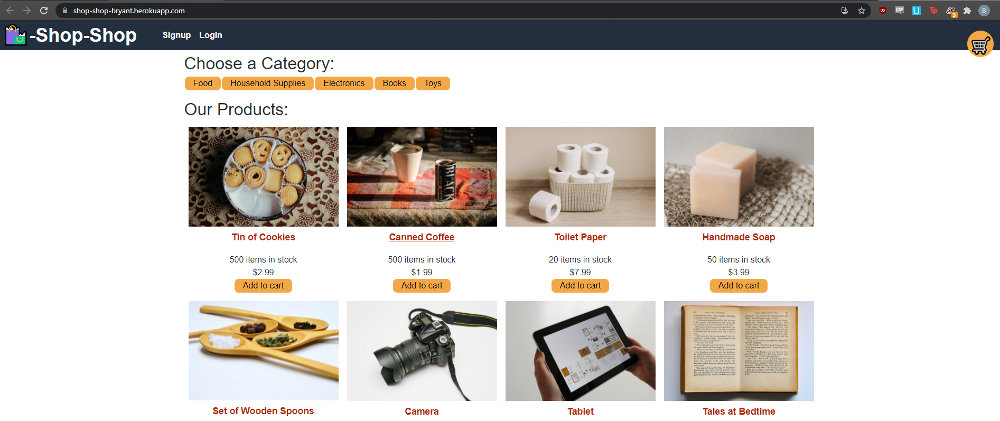

# 🛍️-Shop-Shop-Redux

## About this Project
This project refactors a fictional e-commerce application to use Redux for global state control, paired with a React front end, Node.js and Express.js for the back-end server, and MongoDB for the database. Stripe is used for payments.  

## Installation
Run `npm install` in the root directory, in the client directory, and in the server directory.

From the root directory, type `npm start` to start the Express and GraphQL/Apollo servers. The homepage of the application will open in your default browser.

## Usage
The application is deployed at: https://shop-shop-bryant.herokuapp.com/

Use these login credentials:
- `test@email.com`
- `password1234` 

You can then see order history and test the shopping function. When you check out, you will be directed to a test mode Stripe storefront.

You can use `1234 5678 9101 1121`  as the credit card number with any future date for the expiration date and any three digits for the CVC.

## Screenshot

